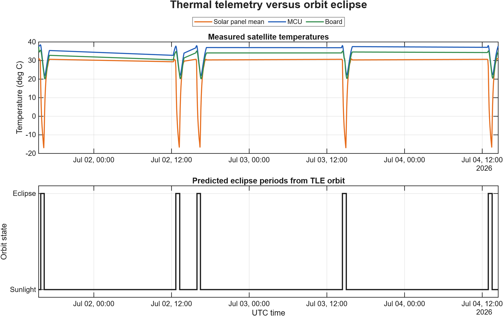
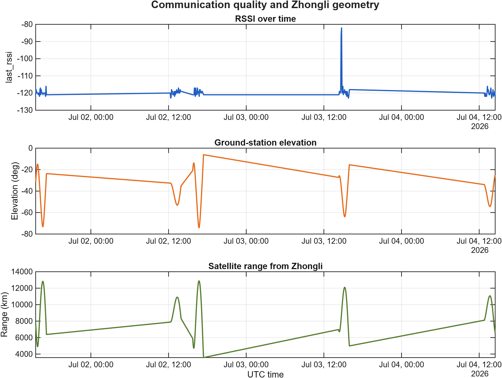
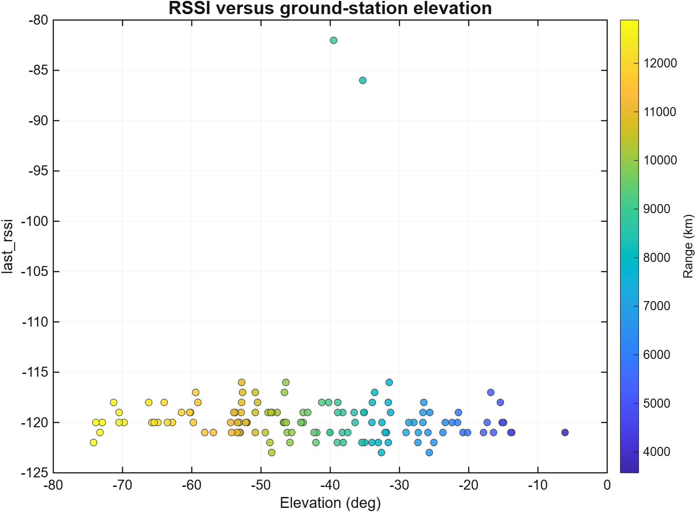
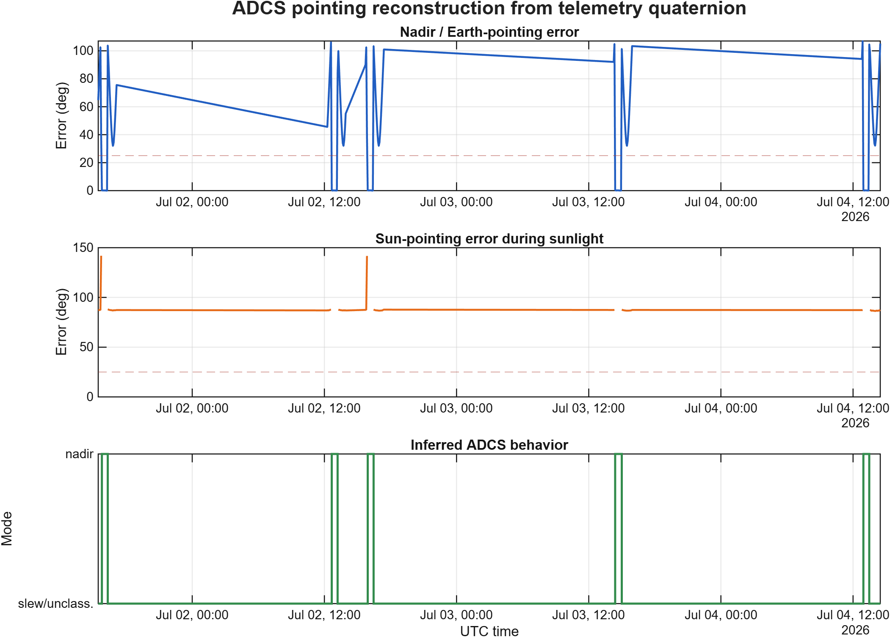
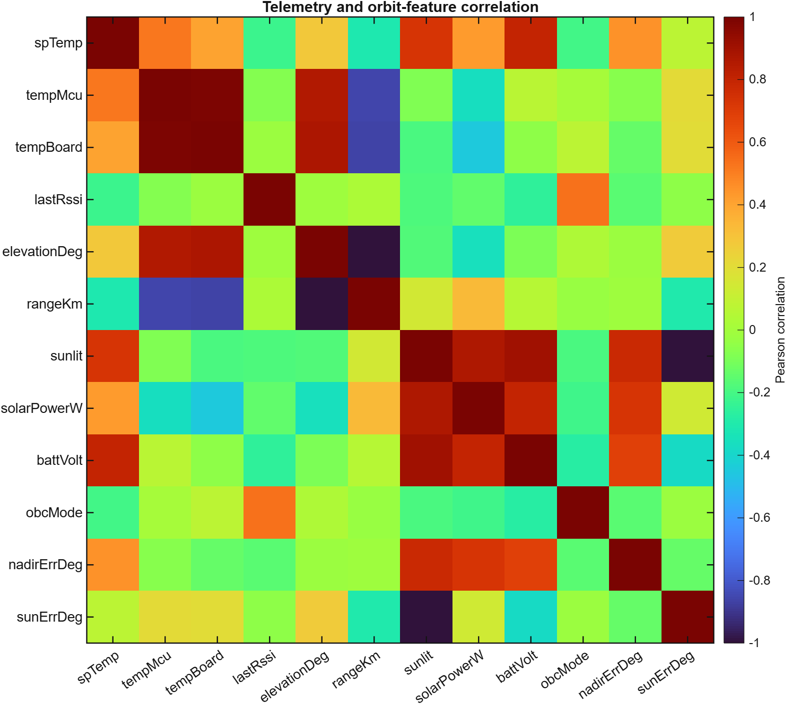
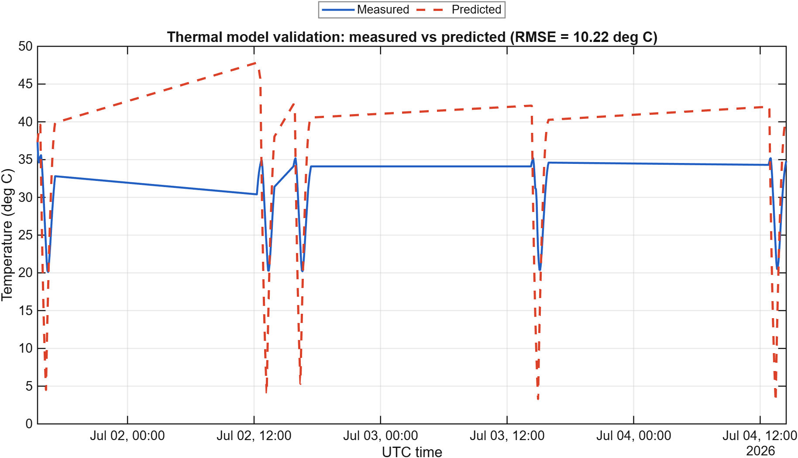
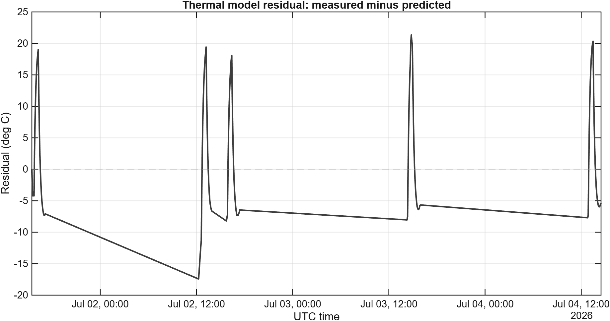
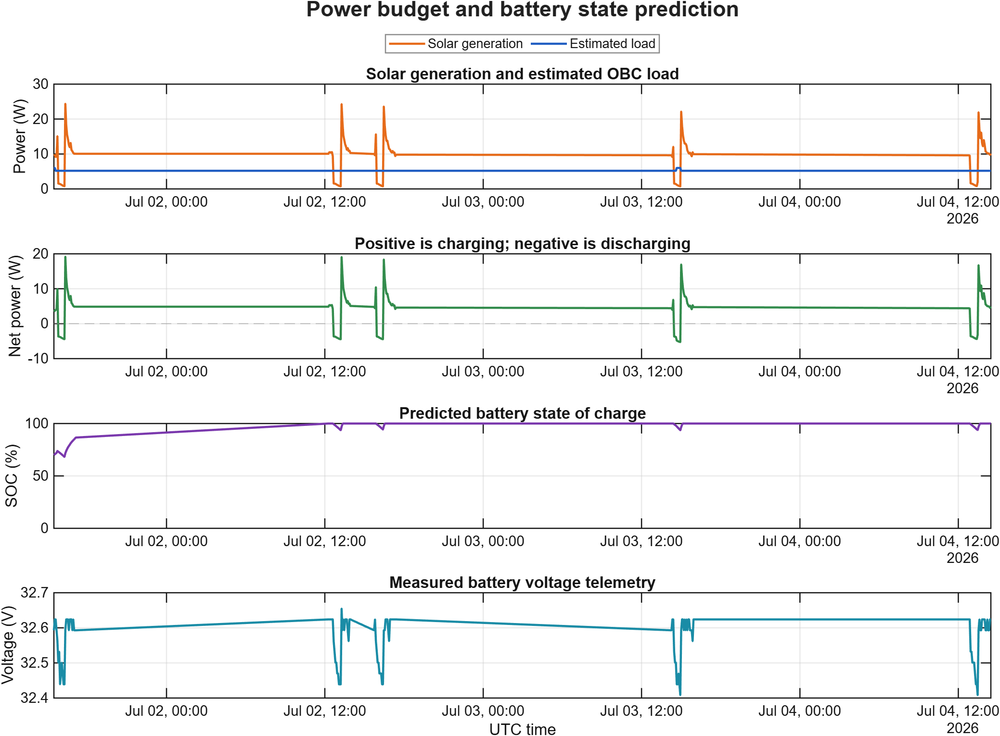

# RIoT-2 衛星軌道、遙測、ADCS 與數位分身分析報告

## 專案簡介

本專案使用 RIoT-2 衛星的 TLE 軌道資料與 housekeeping telemetry，建立一套衛星任務分析與數位分身流程。分析內容包含軌道傳播、地面站可視性、熱遙測、通訊品質、ADCS 姿態重建、姿態指向誤差、熱模型驗證，以及簡化電力預算與電池 SOC 預測。

本專案的目標不只是把衛星資料畫成圖，而是進一步回答工程問題：

- 衛星何時在日照區，何時進入地影？
- 溫度變化是否和軌道日照/地影週期有關？
- 衛星相對中壢地面站是否可見？
- RSSI 是否和仰角或距離有關？
- 是否能由 ADCS quaternion 重建衛星姿態？
- 是否能推測衛星當時可能處於對地、對太陽或轉動狀態？
- 簡化熱模型與電力模型是否能描述實際遙測趨勢？

## 使用資料

本分析使用以下資料與設定：

| 類別 | 內容 |
|---|---|
| 衛星 | RIoT-2 |
| 軌道資料 | `RIoT2_20260706.tle` |
| 遙測資料 | `*-RIoT-2-hk.csv` |
| 地面站 | Zhongli_GS |
| 地面站緯度 | 24.96 deg |
| 地面站經度 | 121.22 deg |
| 通訊頻率假設 | 2.4 GHz |
| 發射功率假設 | 10 W |

使用的 ADCS quaternion 欄位包含：

- `iEstimatedORCquaternionQ0`
- `iEstimatedORCquaternionQ1`
- `iEstimatedORCquaternionQ2`
- `iEstimatedORCquaternionQ3`

## 執行摘要

MATLAB 程式成功讀取並分析以下資料：

| 指標 | 結果 |
|---|---:|
| 遙測資料筆數 | 130 |
| CSV 檔案數 | 5 |
| 遙測開始時間 | 01-Jul-2026 15:28:03 UTC |
| 遙測結束時間 | 04-Jul-2026 14:28:05 UTC |
| 軌道模擬取樣點 | 4262 |
| 中壢地面站可見取樣點 | 133 |
| 中壢地面站可見比例 | 3.12% |
| 有效 quaternion 覆蓋率 | 100.0% |
| 對地指向誤差中位數 | 43.65 deg |
| 對太陽指向誤差中位數 | 87.12 deg |
| 熱模型 RMSE | 10.22 deg C |

## 分析方法

### 1. 遙測資料讀取與清理

程式會自動尋找 RIoT-2 housekeeping telemetry CSV 檔案，將多個 CSV 合併成一份資料表，並進行以下處理：

- 讀取所有 `*-RIoT-2-hk.csv`
- 移除 macOS 產生的 `._` 隱藏檔
- 轉換 Unix time 為 UTC 時間
- 依時間排序
- 移除無效時間
- 移除重複時間點

這一步確保後續所有軌道、姿態、熱、通訊與電力分析都對齊到同一條乾淨的時間軸。

### 2. TLE 軌道傳播

程式使用 MATLAB `satelliteScenario` 與 TLE 建立 RIoT-2 軌道模型，並計算：

- 衛星位置與速度
- 中壢地面站可視時間
- 地面站仰角
- 方位角
- 衛星與地面站距離
- 衛星是否在日照區或地影區

這部分讓遙測資料可以和實際軌道幾何條件互相比對。

### 3. ADCS quaternion 姿態重建

程式讀取 ADCS quaternion，將衛星 body frame 到 ORC/LVLH frame 的姿態轉換，再利用軌道位置與速度把姿態轉到慣性座標系。

最後使用：

```matlab
pointAt(sat, attitudeTT);
```

將重建後的姿態套回 MATLAB 衛星情境中，使衛星姿態可以被重播與分析。

### 4. 姿態指向誤差與模式推測

為了分析衛星是否接近對地或對太陽，本專案加入兩個 body-frame 假設：

```matlab
nadirBoresightBody = [0; 0; 1];
solarArrayNormalBody = [1; 0; 0];
attitudeModeThresholdDeg = 25;
```

程式會計算：

- 假設的對地軸與地心方向的夾角
- 假設的太陽能板法向量與太陽方向的夾角

再依照誤差角度推測 ADCS 狀態：

| 推測模式 | 意義 |
|---|---|
| `nadir_pointing` | 對地指向誤差小於門檻，可能正在對地 |
| `sun_pointing` | 日照時對太陽誤差小於門檻，可能正在對太陽 |
| `slew_or_unclassified` | 可能正在轉動，或目前無法歸類 |
| `no_quaternion` | 沒有可用 quaternion |

需要注意的是，這裡的判斷高度依賴衛星實際 body axis 定義。如果實際相機、天線或太陽能板方向不是上述假設，則需要根據衛星 CAD 或 ADCS 文件重新校正。

### 5. 熱模型數位分身

熱模型使用一階近似方法，輸入包含：

- 實測溫度
- 日照/地影狀態
- 太陽入射 proxy
- OBC mode 對熱源的簡化估計

模型會產生預測溫度，並和實測溫度比較，使用 RMSE 評估模型誤差。

### 6. 電力預算與 SOC 預測

程式會估計：

- 太陽能板發電功率
- OBC 模式對應的估計負載功率
- 淨功率：

```text
netPowerW = solarPowerW - loadPowerW
```

- 電池 SOC

目前 SOC 模型使用以下假設：

| 參數 | 數值 |
|---|---:|
| 電池容量 | 38 Wh |
| 初始 SOC | 70% |

這些是假設值。如果之後取得實際電池規格或電流遙測，可以進一步修正。

## 圖片說明

### 圖 1：熱遙測與軌道地影週期



這張圖用來觀察衛星溫度是否受到日照與地影影響。

上半部顯示三種溫度：

- 太陽能板平均溫度
- MCU 溫度
- Board 溫度

下半部顯示由 TLE 軌道推算出的日照/地影狀態。

可以看到，每次衛星進入 eclipse 附近，太陽能板溫度會明顯下降，MCU 與 board 溫度也會下降，但幅度較小。這是合理現象，因為太陽能板直接暴露在外部環境，對日照變化最敏感；內部電子元件則有較大的熱慣性。

此圖證明 TLE 推算出的軌道日照條件與實際熱遙測具有合理關聯。

### 圖 2：通訊品質與中壢地面站幾何關係



這張圖用來觀察 RSSI 是否和衛星相對中壢地面站的幾何條件有關。

三個子圖分別為：

- RSSI 隨時間變化
- 衛星相對地面站仰角
- 衛星與中壢地面站距離

大多數時間仰角為負值，代表衛星在中壢地面站地平線以下，理論上不是可視通聯狀態。因此，整體 RSSI 不一定會和仰角或距離呈現明顯關係。

此圖的價值在於可以區分「一般遙測時間點」與「真正可能通聯的幾何窗口」。

### 圖 3：RSSI 與地面站仰角散點圖



這張散點圖用來檢查仰角越高時 RSSI 是否變好。

圖中：

- X 軸是地面站仰角
- Y 軸是 RSSI
- 顏色代表衛星與地面站距離

大部分 RSSI 約集中在 `-120 dBm` 附近，只有少數點達到較強的 `-82` 到 `-86 dBm`。相關係數也顯示 RSSI 和仰角、距離幾乎沒有線性關係：

| 關係 | 相關係數 |
|---|---:|
| corr(last_rssi, elevation) | -0.015 |
| corr(last_rssi, range) | 0.025 |

這表示 RSSI 可能不只受距離與仰角影響，也受到天線姿態、發射狀態、通訊封包時間、地面站接收條件等因素影響。

### 圖 4：由 ADCS quaternion 重建姿態指向



這張圖是本專案最重要的 ADCS 延伸分析。

第一個子圖是對地指向誤差。誤差越小，代表假設的衛星對地軸越接近地心方向。

第二個子圖是對太陽指向誤差。誤差越小，代表假設的太陽能板法向量越接近太陽方向。

第三個子圖是根據誤差門檻推測出的 ADCS 行為。

目前結果如下：

| 推測模式 | 樣本數 |
|---|---:|
| `nadir_pointing` | 41 |
| `slew_or_unclassified` | 89 |

整體而言，對地指向誤差中位數為 `43.65 deg`，對太陽指向誤差中位數為 `87.12 deg`。這代表在目前 body-axis 假設下，只有部分時間看起來接近對地指向，多數時間則可能是轉動中、非對地模式，或 body-axis 假設尚未校正。

此圖將原本難以直觀看懂的 quaternion 遙測轉換成可解釋的 ADCS 行為，是作品集中最有研究價值的部分之一。

### 圖 5：遙測與軌道特徵相關係數矩陣



這張圖顯示各個遙測變數與軌道特徵之間的 Pearson correlation。

顏色代表：

- 紅色：正相關
- 藍紫色：負相關
- 綠色附近：相關性弱

幾個合理現象包括：

- `spTemp` 和 `sunlit` 呈現明顯正相關，代表日照時太陽能板溫度較高。
- `tempMcu` 和 `tempBoard` 高度相關，代表電子元件溫度一起變化。
- `rangeKm` 和 `elevationDeg` 呈現負相關，代表衛星距離越近時仰角通常越高。
- `lastRssi` 和 elevation/range 的關係不明顯，表示 RSSI 可能受到其他通訊條件影響。

此圖提供一個快速總覽，可以看出熱、通訊、電力、軌道和姿態變數之間的關聯。

### 圖 6：熱模型驗證



這張圖比較實測溫度與簡化熱模型預測溫度。

模型結果：

```text
RMSE = 10.22 deg C
```

藍線是實測溫度，紅色虛線是模型預測。模型有抓到部分升溫與降溫趨勢，但在多數時間預測偏高，因此目前比較像是初步 thermal digital twin，而不是高精度熱模型。

可能缺少的物理因素包括：

- 衛星姿態相對太陽方向
- 太陽能板實際朝向
- 表面材料吸收率與放射率
- 地球反照率
- 地球紅外輻射
- 元件之間的熱耦合

### 圖 7：熱模型殘差



這張圖顯示：

```text
Residual = 實測溫度 - 預測溫度
```

解讀方式：

- residual 接近 0：模型預測準確
- residual 大於 0：實際溫度比模型高
- residual 小於 0：模型預測溫度偏高

圖中多數 residual 為負值，代表目前熱模型整體偏向高估溫度。幾個明顯尖峰則出現在快速降溫或升溫附近，表示模型對 eclipse 轉換時的熱響應還不夠準。

此圖的價值在於指出模型需要改進的位置。

### 圖 8：電力預算與電池 SOC 預測



這張圖展示簡化電力系統數位分身。

四個子圖分別為：

1. 太陽能發電功率與估計 OBC 負載
2. 淨功率，正值代表充電，負值代表放電
3. 預測電池 SOC
4. 實測電池電壓

由圖可見，多數時間太陽能發電高於估計 OBC 負載，因此模型預測 SOC 很快接近滿電。實測電池電壓約在 `32.4` 到 `32.65 V` 之間，期間有短暫下降，可能對應 eclipse、發電降低或負載增加。

此圖說明可以利用 telemetry 建立簡化 EPS 分析流程，初步評估任務期間是否存在能量風險。

## 關鍵工程結論

1. 本次分析成功整合 5 個 telemetry CSV，共 130 筆有效資料。
2. 資料時間範圍約 71 小時。
3. TLE 軌道推算顯示，中壢地面站可視取樣比例約為 3.12%。
4. ADCS quaternion 覆蓋率為 100%，代表姿態重建資料完整。
5. 在目前 body-axis 假設下，共 41 筆資料被判斷可能接近對地模式。
6. 太陽能板溫度與日照狀態具有明顯正相關。
7. RSSI 與地面站仰角/距離沒有明顯線性關係。
8. 一階熱模型 RMSE 為 10.22 deg C，適合作為 preliminary digital twin baseline。
9. 簡化電力模型顯示分析期間沒有明顯電量耗盡風險。

## 限制與假設

本分析仍有一些需要清楚說明的限制：

- ADCS 模式推測依賴 body-axis 假設，尚未用實際衛星 CAD 校正。
- 熱模型是一階簡化模型，並非完整熱控模型。
- SOC 模型使用假設電池容量與初始 SOC。
- OBC 負載功率是根據 mode 估算，不是直接量測。
- RSSI 可能不只受仰角與距離影響，也受天線姿態與通訊狀態影響。
- 地影判斷使用簡化 cylindrical eclipse model。

## 未來延伸方向

### ADCS 分析延伸

- 使用衛星 CAD 或 ADCS 文件校正 body axis。
- 加入 gyro angular velocity，分析 detumbling 或 slew rate。
- 若 telemetry 有 commanded mode，可比較指令模式與推測模式。
- 加入對地面站指向誤差，分析天線是否對準地面站。

### 通訊分析延伸

- 建立完整 link budget。
- 加入 free-space path loss。
- 加入 Doppler shift。
- 加入 antenna gain pattern。
- 只針對真正 access window 內的資料分析 RSSI。

### 熱模型延伸

- 使用資料自動 fit thermal model parameters。
- 加入實際姿態與太陽入射角。
- 分別建立 solar panel、MCU、board、battery 的熱模型。
- 加入 Earth albedo 與 Earth IR。

### 電力模型延伸

- 使用實際電流 telemetry 取代估計 OBC load。
- 使用真實 battery capacity 與 voltage-SOC curve。
- 加入 payload/transmitter duty cycle。
- 分析 eclipse 期間放電與 sunlight 期間充電效率。

## 作品集呈現方式

本專案可以包裝成以下主題：

> 基於 TLE 與衛星遙測資料之 RIoT-2 CubeSat 軌道、姿態、熱控、通訊與電力數位分身分析系統

此作品展示的能力包括：

- 衛星軌道傳播
- TLE 資料使用
- 遙測資料清理與整合
- ADCS quaternion 姿態重建
- 對地與對太陽指向誤差分析
- 地面站 access 分析
- 通訊品質分析
- 熱模型建構與驗證
- 電力預算與 SOC 預測
- MATLAB 工程視覺化
- 自動化報告輸出

